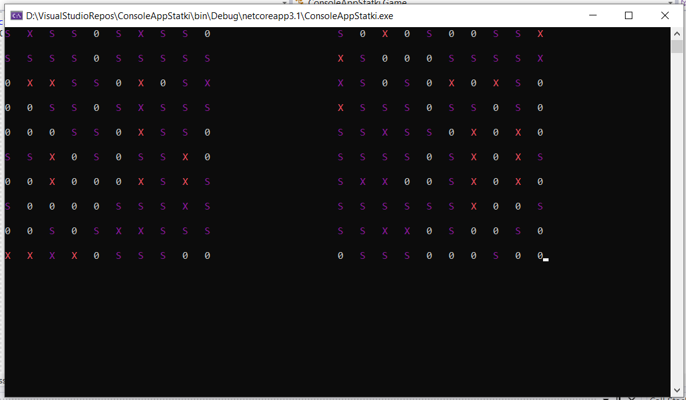

Aplikacja zostala poszerzona o front w reakcie, ktory jest bardzo surowy i nie taki jak bym chcial, reaktoring silnia wymagany,
Jesli chodzi o wczesniejsza aplikacja consolowa zostala zmieniona na biblioteke i zrefaktoryzowana wedlug zasad (mam nadzieje) Czystego Kodu

//TODO ponizej tekst do zaaktualizowania

1)przechowywanie wynikow oraz konstrukcja modelu: myslalem nad tablica dwuwymiarowa, ostatecznie wybralem liste

2)losowanie statkow na mapie: ze wzgledu na wybrany model statku, (czyli uwzgledniajacy jego poczatek i koniec) 
	w pewnym sensie narzucilem sobie sposob losowania statkow, a polega on na tym aby miec liste wszystkich mozliwych kombinacji ustawienia statkow,
	i losowac z tej puli a nastepnie usowac z listy wszystkie ktore dotykaja wybranego/ych statkow

3)komputer: losowanie ustawilem najprosciej jak sie da z filtrowaniem pol ktore juz zostaly wylosowane,
	-dodalem mechanizm ktory w przypadku zniszczenia statku ustawia pola wokol niego na sprawdzone
	-nie dodalem mechanizmu ktory w przypadku trafienia kontynuuje celowanie w danym regionie

  

